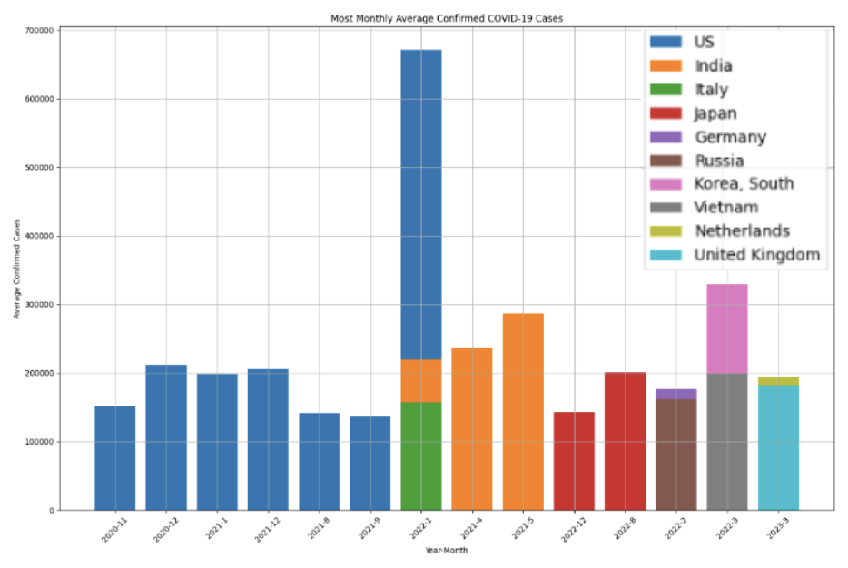
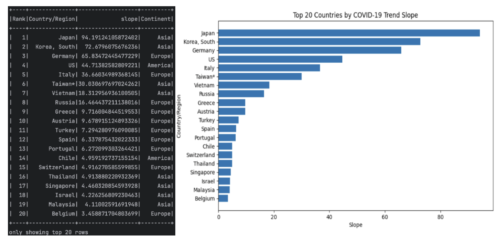
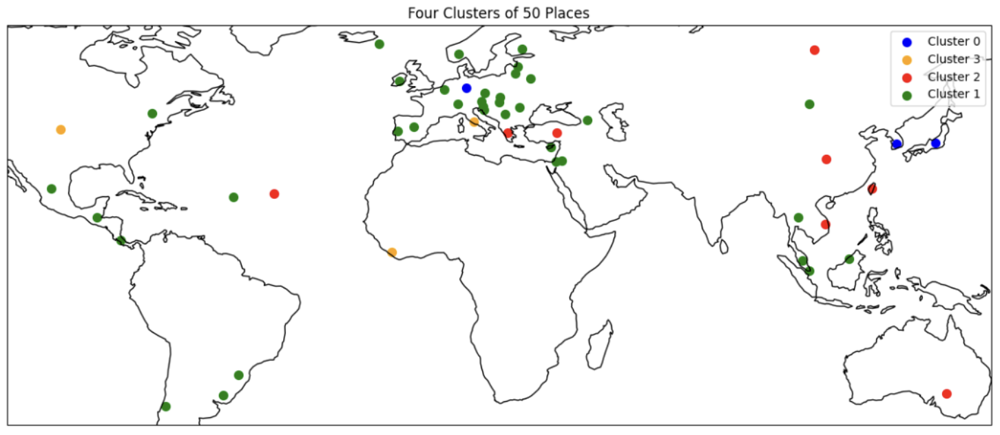

# Pyspark COVID-19 Data Analysis

The goal of the project is to address some queries regarding the COVID-19 pandemic at a global level, using the Apache Spark data processing framework.

### [Dataset](https://github.com/CSSEGISandData/COVID-19/blob/master/csse_covid_19_data/csse_covid_19_time_series/time_series_covid19_confirmed_global.csv)

## Project Tasks Overview

This project focuses on analyzing and clustering COVID-19 data across various countries and continents, using statistical methods and machine learning algorithms. Below are the key tasks:

### 1. Calculate the Mean Number of Confirmed Cases for Each Country
For each country in the dataset:
- Calculate the **mean number of confirmed cases daily** for **each month**.
- This analysis will help identify the monthly trend of COVID-19 cases across countries.

### 2. Analyze COVID-19 Cases by Continent
For each continent:
- **Calculate the mean, standard deviation, minimum, and maximum** number of confirmed cases daily for **each week**.
- The statistics will focus on the **100 states most affected** by the pandemic. If a state is not indicated, the country will be considered instead.
- To determine the **most affected states**, we will use the **trendline coefficient** based on the **slope of the regression line**, which estimates the trend of daily increases in confirmed cases.
- The **continent** to which each state/country belongs is not explicitly stated in the dataset, so it will be identified manually. We consider six continents: **Africa, America, Antarctica, Asia, Europe, and Oceania**.

### 3. Clustering the 50 Most Affected States
For each month in the dataset:
- Identify the **50 most affected states** based on the **trendline coefficient** (calculated monthly).
- Apply the **K-means clustering algorithm** (with K=4) to group states with similar patterns of daily increases in confirmed cases.
- Each cluster will group states or countries that exhibit similar COVID-19 case trends over time.

